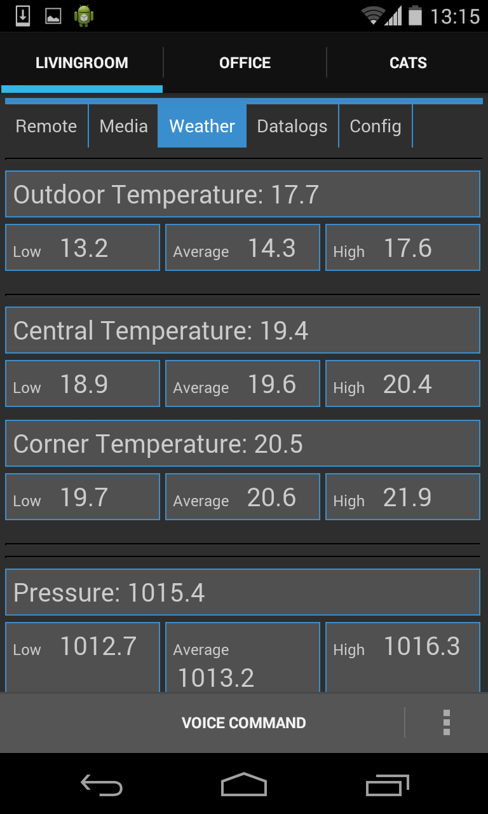
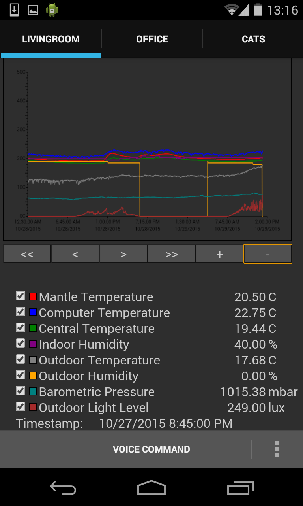
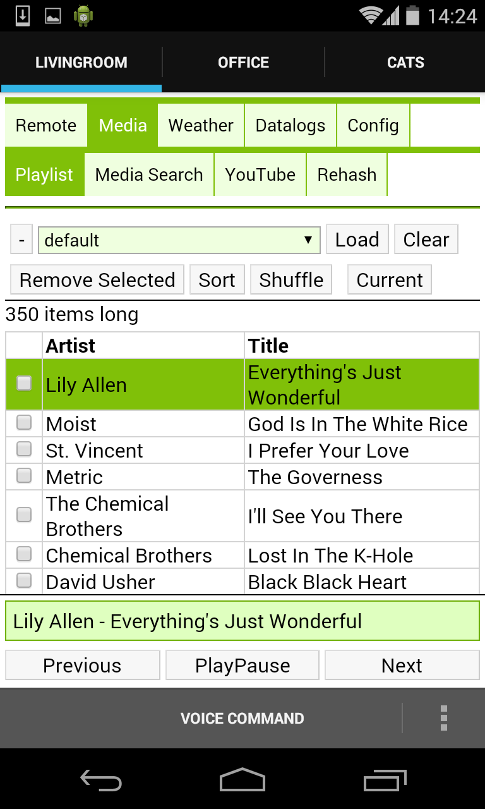

Nerve Control Network
=====================

###### *Started August 05, 2013*
 
Nerve is a web-based home automation system implemented in python3.  It's primarily used as an interface to a media
player/media library (VLC, XMMS2, etc).  Its modular structure makes it easy to extend and customize, and its generic
widgets and devices system makes it easier to tie together different hardware devices, sensors, and internet
information sources into one place (or across distributed servers).

Installation
------------

Unpack the source code where ever is most convenient.  Check out dependencies.txt for a list of the Debian packages
required for various features.  Most Debian/Ubuntu based distros will likely have the same package names.  The code has
been run in Windows 7, with python and the necessary python libraries installed manually, although I no longer test the
code on Windows.

To run the code, while in the source directory, use the command:
```
python3 nerve.py
```

The default configuration directory is ~/.nerve, however it can be set on the command line:
```
python3 nerve.py -c config/<site>
```
The configuration for a particular instance is stored entirely in the configuration directory.  Different instances can
be run on the same computer by simply specifying a different configuration directory to use.

Even better is to run nerve using:
```
nerve.sh config/<site>
```
This script will check for a 'restart' exit status and relaunch nerve if found, so that the server can be restarted
using a specific query.

Configuration
-------------

To configure an instance of nerve, you might want to start with one of the example configurations included in the
config/ directory of the source code.  The settings.json file is the main config file.  It describes what objects to
create when the system starts, what configuration settings each object should initially be set to, and where in the
object filesystem hierarchy the object should be placed.

At the heart of each instance is a hierarchy of objects that are accessible with a path-like reference.  The three top
level 'directories' are '/modules', '/devices', and '/servers'.  The contents of the '/modules' directory is
automatically generated based on the available modules in the system.  The '/devices' and '/servers' directories
contain all the device and server objects respectively.  This is by convention only and is not enforced.

Gallery
-------








[More pictures](https://github.com/transistorfet/nerve/blob/master/GALLERY.md)

